# Hiraeth — Design Direction Presentation Pack

Three full-site design prototypes, rendered with real catalog data (23 independent presses, real book titles, real cached covers, self-hosted OFL fonts). Nothing here loads from the network; every page is self-contained and CSP-clean.

This is the **decision gate**: the direction you pick here is what gets implemented across all 11 public routes. A choice of one, an explicit hybrid brief, or a request for iteration are all valid answers.

---

## Decision Rubric

The five axes below make the three options comparable. Read each direction's section against the same scale.

| Axis | What it asks |
| --- | --- |
| **Readability** | How comfortable is sustained reading — type size, measure, contrast, line rhythm? Both light and dark reading conditions? |
| **Cover prominence** | How much visual weight do the covers carry? Is the catalog "a bookshelf" or "a spreadsheet with pictures"? |
| **Density / browsability** | How many titles can the eye compare per screen? How fast can a skimmer navigate the archive? |
| **Distinctiveness** | Does it feel like a deliberate identity, or a default? Does it stand apart from every other bookstore template? |
| **Implementation risk** | How far is the prototype from the current token layer (`assets/css/app.css` + `qi-*` classes + LiveView templates)? Where could it fight the existing component model or browser QA gates? |

Mobile behavior is judged at the pinned 390×844 viewport (the exact width `browser_qa_contract_test.exs` audits for overflow).

---

## A. Gallery — museum-wall calm

**Design rationale.** A quiet, paper-white reading room. Oversized Newsreader display headlines (clamped roughly 3–6rem), generous whitespace, hairline rules, and a single thread-red accent used sparingly — the palette is `#FBFAF7` paper, `#1B1714` ink, and `#A33417` thread. The grid is cover-forward: a 4–5 column wall of books with a soft hover lift and shadow. Covers are the heroes; the chrome recedes. A minimal sticky masthead keeps the wordmark and nav in reach without competing with the books.

**What it excels at.** Cover prominence and an editorial, long-form feel. This is the direction that makes Hiraeth feel like a small press itself — a place you linger. The oversized serif display type is the strongest brand signal of the three, and hover interactions make the browse grid feel tactile.

**What it sacrifices.** Density. Fewer titles are visible per screen than Ledger, so comparative browsing across a large corpus (8,776 volumes) is slower. The whitespace-first layout also carries the most implementation risk for a live data surface: arbitrary-length titles, missing covers, and long publisher names will fight the airy grid more than the other directions.

**Captures.**

| Page | Desktop 1440×900 | Mobile 390×844 |
| --- | --- | --- |
| Home | 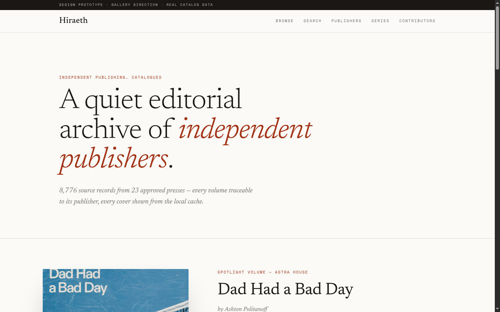 | 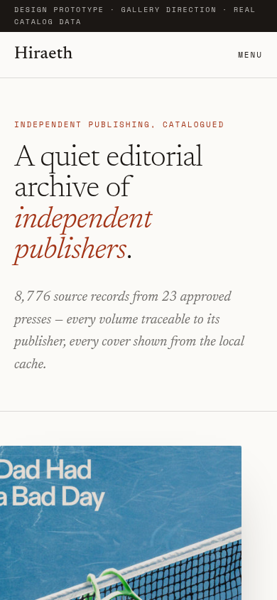 |
| Browse | 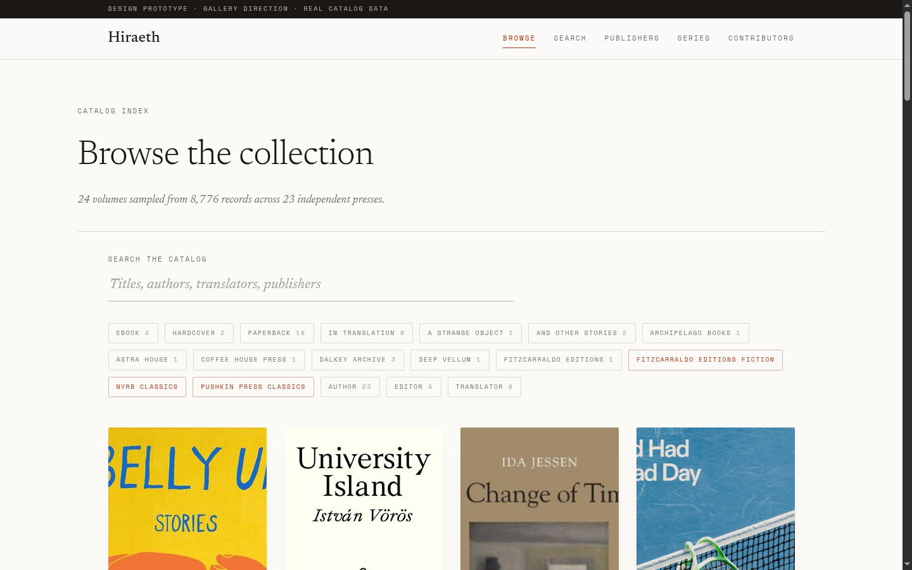 | 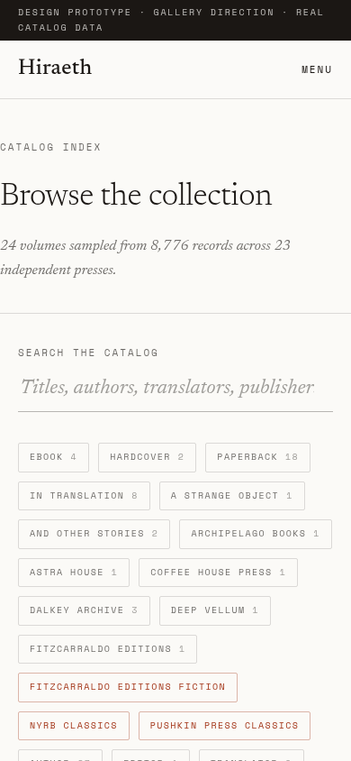 |
| Book | 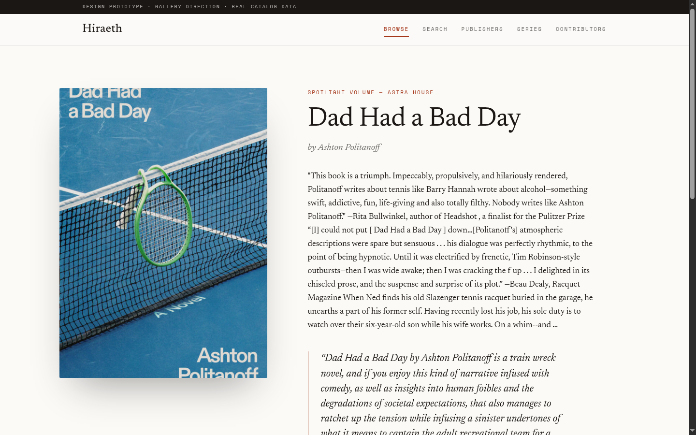 | 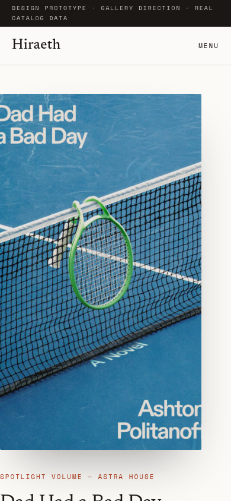 |
| Publishers | 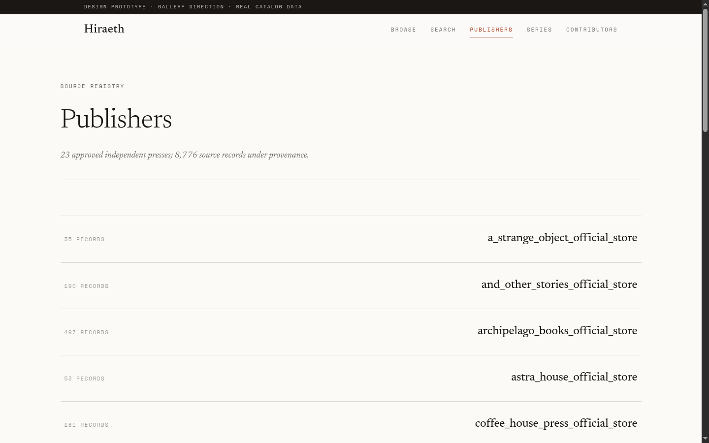 | 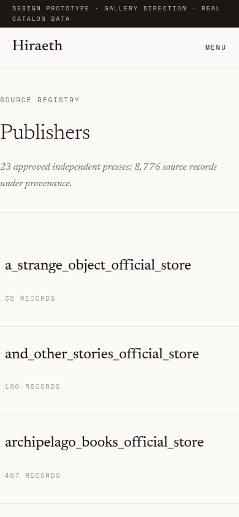 |

**Feature-compliance note.**

- **DOM-id preservation:** keeps all 76 ids in `dom-id-preserve-list.txt` untouched — this is a pure token/class-layer restyle (todo 11–15 apply the direction to the existing `qi-*` classes and templates; no id renames or removals).
- **CSP-safe:** zero external URLs, zero scripts, fonts and covers served from the local cache. Safe under the hard CSP in `router.ex`.
- **Dark mode story:** none. Gallery is a light-only direction — the current site has a dark toggle via `[data-theme="dark"]`, and Gallery would keep that token switch but the design language is tuned for light. This is a genuine gap to weigh.
- **390px behavior:** single/dual-column collapse at 390px (max-width: 390px breakpoint present), masthead condenses to a menu; captures show the mobile grid intact with no horizontal overflow at the audited width.

---

## B. Ledger — archive-index density

**Design rationale.** A reference-work archive. Numbered tabular rows (001, 002, …), Space Mono labels, strong 1px rules, and small cover thumbnails at 64–84px. The palette is high-contrast ink-on-paper (`#15120B` ink on `#F6F3EA`) with the accent reserved for active states. A left rail index plus a two-column body gives the layout a controlled, instrument-like precision — the site as a catalog card, not a magazine.

**What it excels at.** Density and browsability above all. This is the fastest direction for scanning many titles, comparing formats, and finding a specific book in a large corpus. It is also the closest structural relative to the current site's row-heavy lists, which lowers implementation risk: row, table, and index patterns map cleanly onto the existing component model.

**What it sacrifices.** Cover prominence. The small thumbnails are informational, not atmospheric — this direction will never feel like a bookstore shelf, and first-time visitors scanning for pretty covers will see data before imagery. The brutalist-lite precision can also read as austere unless the accent is used with care.

**Captures.**

| Page | Desktop 1440×900 | Mobile 390×844 |
| --- | --- | --- |
| Home | 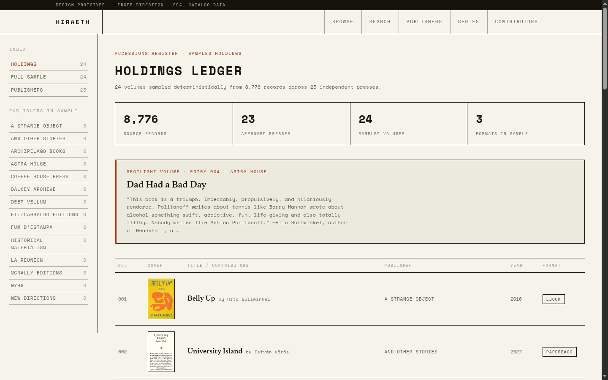 | 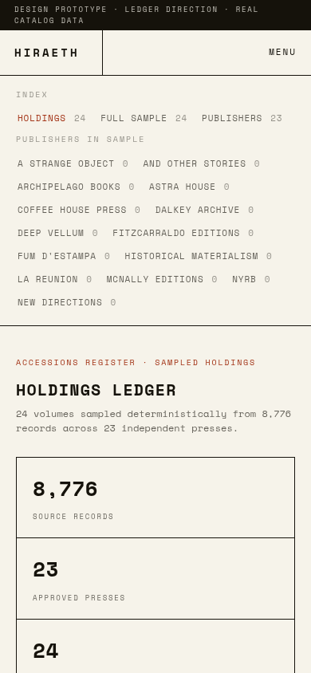 |
| Browse | 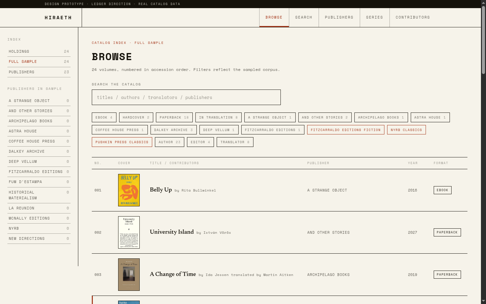 | 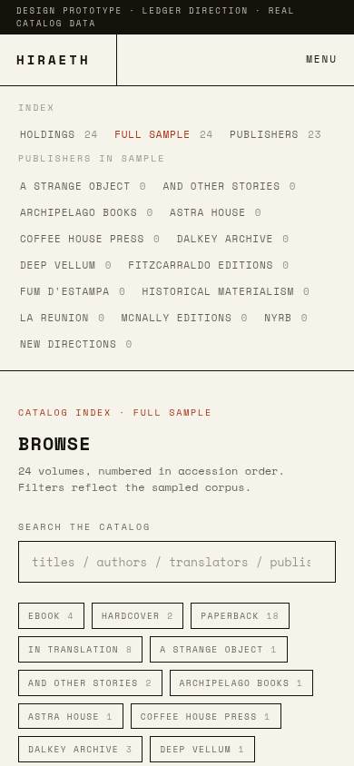 |
| Book | 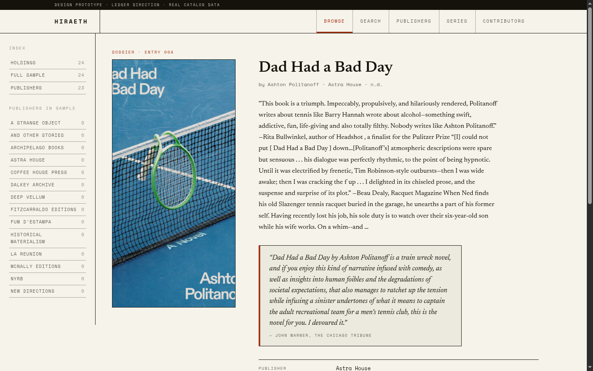 | 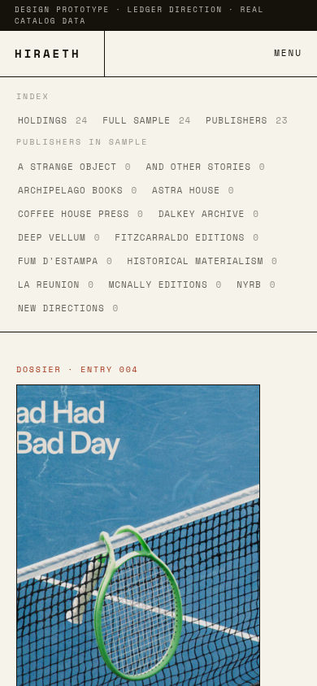 |
| Publishers | 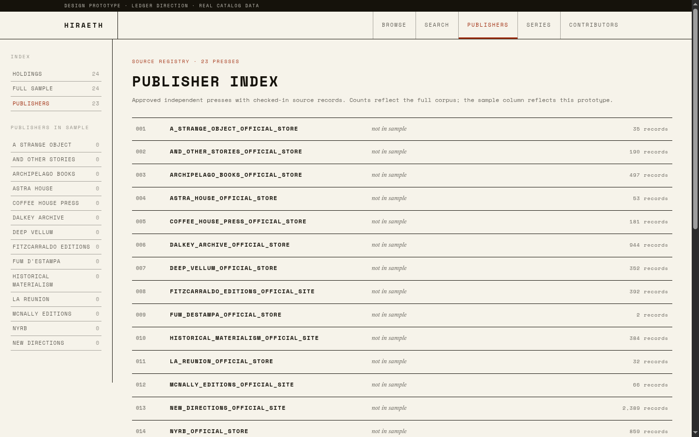 | 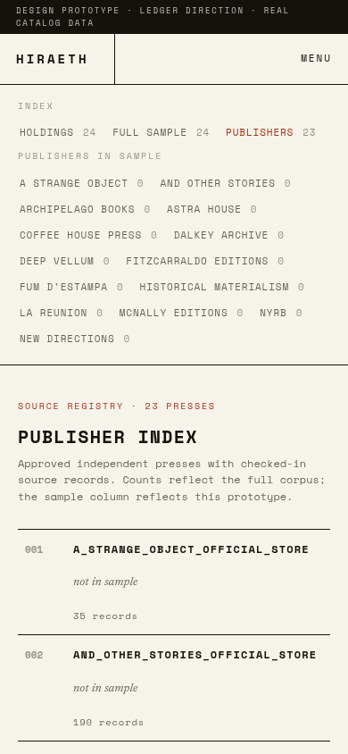 |

**Feature-compliance note.**

- **DOM-id preservation:** keeps all 76 ids untouched (class/token-layer restyle only; the numbered rows and rail map onto existing list/grid ids such as `catalog-grid`, `series-rows`, `contributors-grid`).
- **CSP-safe:** zero external URLs, zero scripts, self-contained fonts/covers. Safe under the hard CSP.
- **Dark mode story:** none — Ledger is light-first with a high-contrast ink treatment. Dark-mode support would need the `[data-theme="dark"]` token work to stay true to the direction's precision.
- **390px behavior:** the rail collapses and rows reflow at 390px (max-width: 390px breakpoint present); captures show dense but non-overflowing mobile layout at the audited width.

---

## C. Night Reading — dark-first warm reading room

**Design rationale.** A warm, dark reading room built for evenings: warm charcoal background (`#16120E`), lamplight amber (`#E0A458`) and thread red for links, large comfortable Newsreader, horizontal shelf rows, and deep soft shadows. It is cozy-premium — the opposite of the flat template look. A distinctive pure-CSS "Reading lamp" checkbox flips the entire palette to a warm-cream light variant (`body:has(#lamp:checked)`), giving the direction a real dark/light story with zero JavaScript.

**What it excels at.** Distinctiveness and the dark-mode story. This is the only direction with a native, script-free light/dark toggle, and it is the most memorable identity of the three — no other bookstore looks like this. The dark-first design also flatters the cover artwork, which pops against warm charcoal the way it does on neither light direction.

**What it sacrifices.** Browsability in bright environments and conventionality. High-contrast light readers may find a dark surface harder for long daytime sessions despite the lamp variant, and the theatrical mood is a stronger taste statement — a brand you either love or find heavy. Density sits between Gallery and Ledger.

**Captures.**

| Page | Desktop 1440×900 | Mobile 390×844 |
| --- | --- | --- |
| Home | 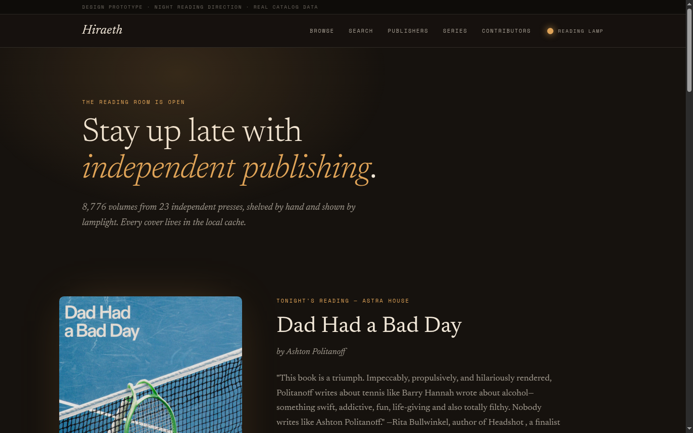 | 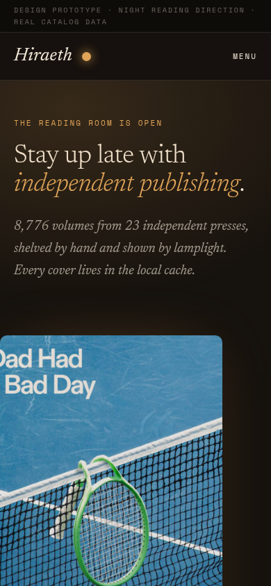 |
| Browse | 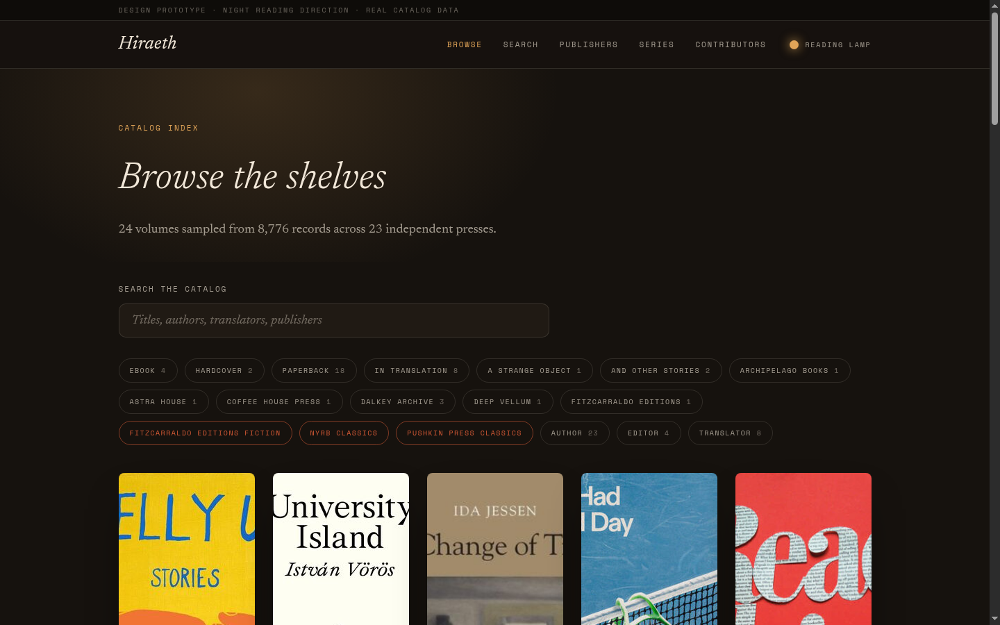 | 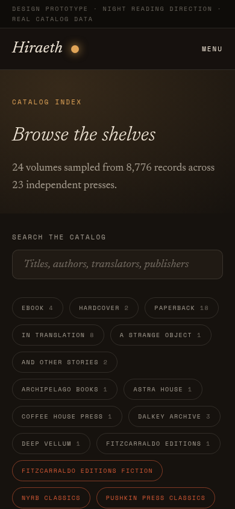 |
| Book | 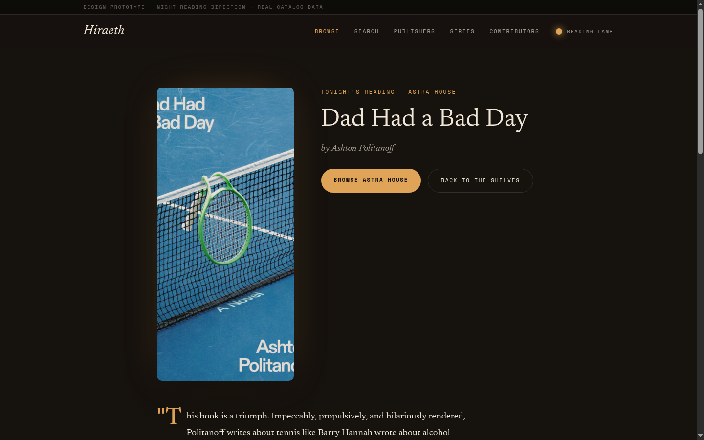 | 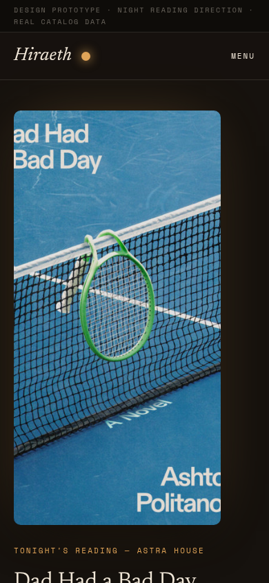 |
| Publishers | 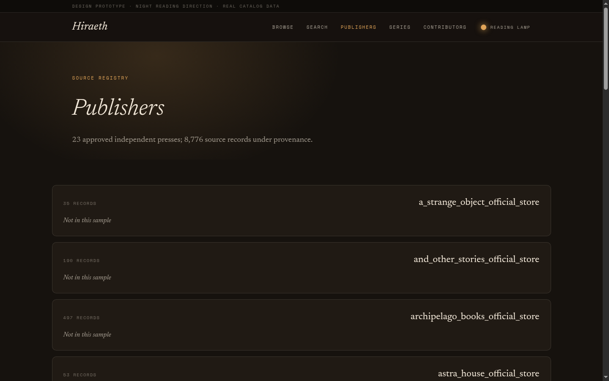 | 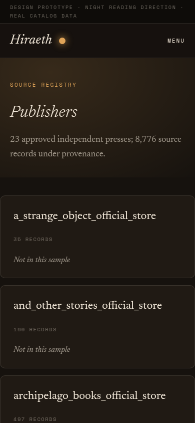 |

**Feature-compliance note.**

- **DOM-id preservation:** keeps all 76 ids untouched; the lamp checkbox (`id="lamp"`) is a prototype-only control and would be re-expressed with the existing `[data-theme]` mechanism during implementation.
- **CSP-safe:** zero external URLs, zero scripts, self-contained fonts/covers. Safe under the hard CSP.
- **Dark mode story:** strongest of the three — dark-first by default with a pure-CSS light variant, directly compatible with the existing `[data-theme="dark"]` token switch.
- **390px behavior:** shelf rows collapse at 390px (max-width: 390px breakpoint present); captures show the dark mobile layout intact with no horizontal overflow at the audited width.

---

## Decision Summary

| | A. Gallery | B. Ledger | C. Night Reading |
| --- | --- | --- | --- |
| Readability | Excellent in light; no dark story | Strong, high contrast; no dark story | Strong dark + light (lamp) |
| Cover prominence | **Highest** | Lowest | High |
| Density / browsability | Lowest | **Highest** | Medium |
| Distinctiveness | High (editorial) | Medium (instrument) | **Highest (mood)** |
| Implementation risk | Higher (airy grid fights variable data) | **Lowest (row/list affinity)** | Medium (dark token layer + contrast care) |
| Mobile 390×844 | Passes (single/dual column) | Passes (rail collapse) | Passes (shelf collapse) |

**Choose A, B, or C** — or give an explicit hybrid brief (e.g. "B's density with C's dark story" or "A's covers with B's rows"). State which direction to implement, and I will record the selection and begin the token-layer and layout implementation (todos 11–15) against the chosen direction, preserving all 76 DOM ids in `dom-id-preserve-list.txt`.
